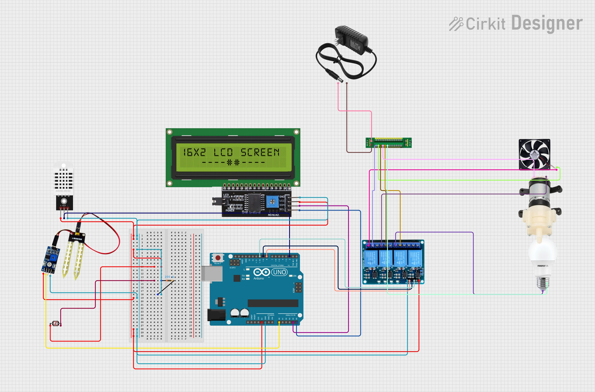

# Smart Greenhouse Farming Automation System
## Overview
This project  is a **Smart Greenhouse Farming Automation System** designed to monitor and control environmental conditions such as temperature, humidity, light and soil moisture. The system automates processes like watering, lighting, and ventilation to optimize plant growth.

## Features
- Automatic **watering** based on soil  moisture levels.
- **Light control** with relays for artificial lighting
- **Temperature and humidity regulation** using a fan and sensors.
- **LCD Display(16 * 2)** shows real-time sensor readings.
- **Electrically powered** for continuous operation

## Hardware Components
- Arduino UNO
- DHT22(Temperature and humidity sensor)
- Soil Moisture sensor
- Light sensor
- Relays(for water pump, light, fan)
- 16 * 2 LCD Display
- Connecting wires and breadboard
- Power supply

## Circuit Diagram

